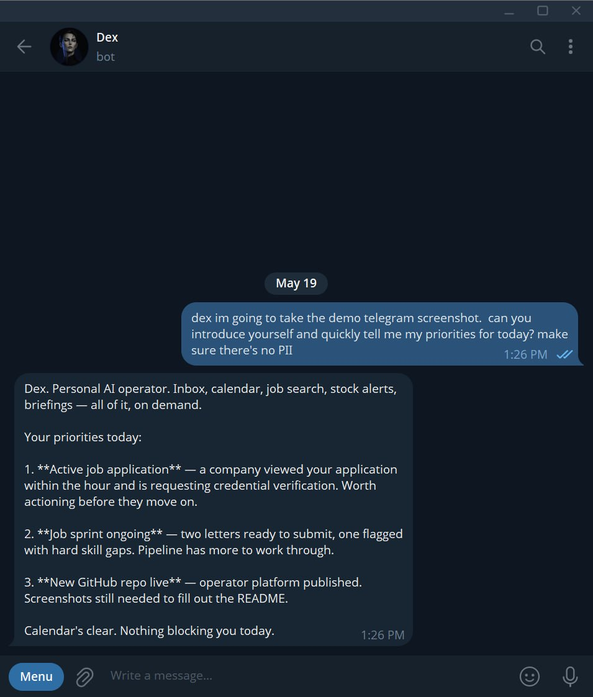
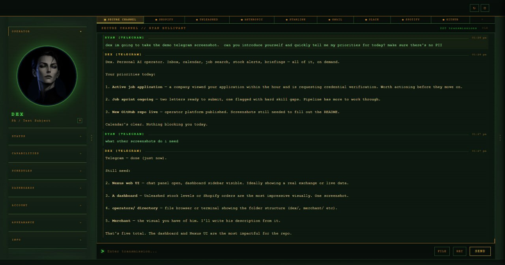
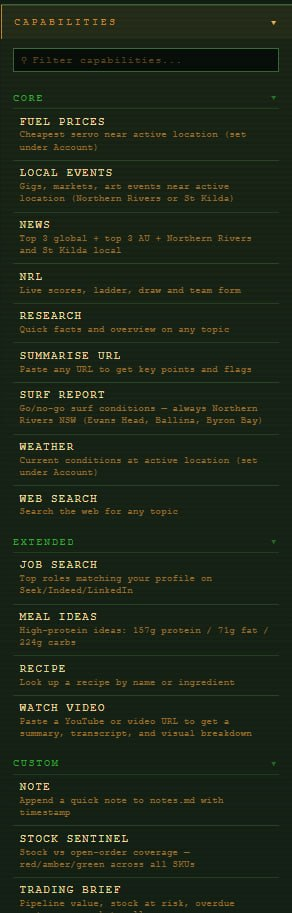
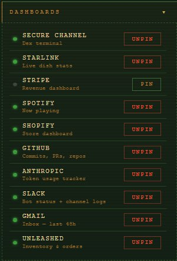
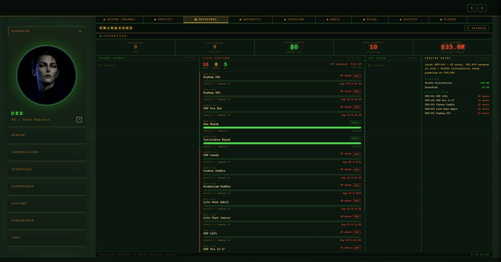
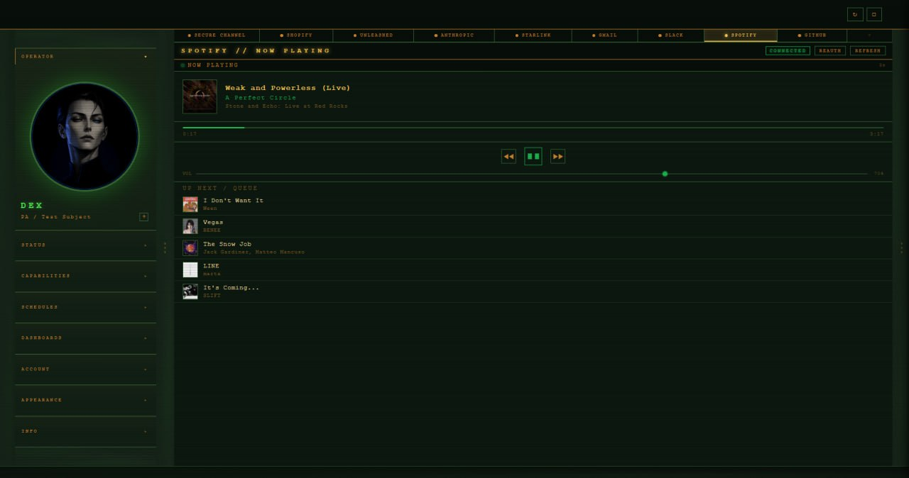
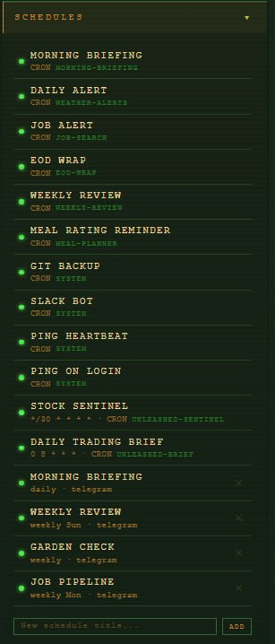
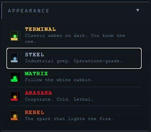

# Operator


Most productivity tools don't talk to each other. You've got a Telegram message, an open calendar, an inbox, a Slack thread, and a Shopify order — all needing attention, all in separate places, none sharing context. Every switch costs you the thread.

Operator is a personal AI operations layer that puts a single AI assistant across all of it. Built around a persistent event log, tool adapters, and LLM decision-making. Self-hosted, single-operator or small-team scale.

---

## What It Is

An **operator** is a focused AI assistant with a defined identity, a specific scope, and a curated set of tools. Not a general-purpose chatbot — each operator is configured for a role: inbox management, inventory monitoring, commerce ops, or whatever the deployment requires. The identity lives in a system prompt; the capabilities come from skills, integrations, and scheduled jobs layered on top.

### How it works

The primary channel is **Telegram**. Send a message and it hits a bot webhook, which routes it to a running Claude Code session — the operator's brain. Claude reads the message in context, decides what to do, calls the relevant tools or skills, and sends a reply. The whole exchange is written to a shared conversation log tagged by source channel and timestamp.

That same log is read by every other channel. Open the **Operator web UI**, type a follow-up, and the operator already knows what you were talking about on Telegram. A **Slack** message lands in the same thread. A scheduled job fires at 7am and its output joins the same history. One persistent brain, multiple entry points — no context loss between channels.

The system executes in a single-threaded conversational loop per operator, with sequential tool invocation and a unified append-only event log.

Behind the scenes, integrations work in two ways depending on the layer. The **CLI layer** uses **MCP connectors** (Model Context Protocol — an open standard for AI tool use) to access Gmail, Google Calendar, Drive, Canva, and more, with auth handled via OAuth through claude.ai. The **web UI layer** reimplements the same integrations as custom Python adapters, making the platform fully portable to any VPS without a CLI dependency. **Python hooks** run outside the AI context on every tool call, session start, and session end — they handle logging, cross-channel mirroring, and safety enforcement regardless of what the model does. **Skills** are markdown instruction files that load at runtime, letting you add capabilities without touching application code.

The real power comes from combining all three extension layers. An operator's **skills** give it capabilities. Its **dashboards** surface live data without needing to ask. Its **schedules** make it proactive rather than reactive — briefings at 7am, stock alerts the moment a threshold is crossed, weekly digests sent automatically. A well-configured operator doesn't wait to be told what to do.

---

## Live Example: Dex

The reference deployment — a personal AI operator running daily since early 2026. Handles a real workload across Telegram and a local web UI. Context is preserved between channels: one brain, multiple entry points.

**What it does in production:**

- Triage and draft emails via Gmail, with full thread context
- Create, update, and delete Google Calendar events from plain-language instructions
- Deliver daily briefings: news, weather, surf report, today's schedule — one message, no fuss
- Monitor inventory via the Unleashed Sentinel and fire Telegram alerts the moment stock goes RED
- Automate a weekly grocery run: browse Coles, clear the cart, add items sorted by price
- Generate tailored job application cover letters from a job description
- Transcribe Telegram voice messages via Whisper API before processing
- Run a personalised TV guide weekly, delivered by email
- Track fire danger and flood warnings (NSW RFS / BOM) for a remote rural property
- Log sessions, maintain memory across restarts, recover gracefully after context resets

Responds in seconds. Occasionally sarcastic.



*Dex delivering priorities via Telegram*



*The Operator web UI — same conversation, different channel*

---

## Architecture

The platform runs in two layers depending on whether server portability is needed:

```
                        CHANNELS
        ┌─────────────┬──────────────┬─────────────┐
        │  Telegram   │    Slack     │  Operator   │
        └──────┬──────┴──────┬───────┴──────┬──────┘
               │             │              │
               └─────────────┼──────────────┘
                             ▼
                  Unified conversation log
               (conversation.jsonl — tagged
                by source channel + timestamp)
                             │
               ┌─────────────┴─────────────┐
               ▼                           ▼
      Claude CLI operators          FastAPI web UI
      + MCP tool connectors         + Python tooling layer
      (Gmail, Calendar, Drive,      (Google OAuth2, Slack API,
       Canva — auth via             custom integrations)
       claude.ai OAuth)             — portable to any VPS
       — desktop/local
               │                           │
               └─────────────┬─────────────┘
                             ▼
                     Operator registry
                     (operators/ directory)
                     config.json + system.md
                     + skills/ per operator
```

**MCP** (Model Context Protocol) is an open standard that lets an AI model call external tools at runtime — like a function library, but the AI decides when and how to use each tool. The CLI layer uses this to give operators access to Gmail, Calendar, Drive, and Canva without writing integration code — OAuth is handled by claude.ai.

The **web UI layer** reimplements the same integrations natively in Python, making it fully portable to a server without a CLI dependency.


---

## Operator Registry

Each operator is a self-contained directory:

```
operators/
  dex/
    config.json       — id, name, model, channel, log path
    system.md         — persona, scope, allowed tools, response format
    skills/           — operator-specific skill overrides
```

The web UI loads all operators at startup. Operators can be added, updated, or swapped without touching application code.

New integrations, dashboards, skills, and scheduled jobs can all be added without rebuilding the platform. New integration: add it to the Python tooling layer and register the tool. New dashboard: a self-contained HTML page served by the FastAPI backend. New skill: a markdown instruction file. New scheduled job: a cron definition per operator. Each extension is isolated — nothing breaks when you add something.


---

## Skills System

Operators are extended through **skills** — prompt-based instruction sets that load dynamically at runtime. Each skill is a markdown file: what it does, when to invoke it, and step-by-step execution instructions. Skills guide the model's behaviour; they don't enforce it at the execution layer. Think of them as structured prompting, not compiled modules.

```
skills/
  cover-letter/       — tailored job application letters
  job-search/         — SEEK/LinkedIn lookup and filtering
  meal-planner/       — weekly meal prep and grocery lists
  surf-report/        — swell conditions via BoM and Swellnet
  calendar/           — Google Calendar queries and updates
  gmail/              — inbox triage and email drafting
  weather-alerts/     — fire danger and flood warnings (NSW RFS / BOM)
  coles-shop/         — automated grocery cart via Playwright browser
  unleashed-sentinel/ — inventory monitoring and reorder alerts
  shopify/            — order lookup, fulfilment status, POS support across retail locations, product management via Admin API
  tv-guide/           — personalised weekly TV picks delivered by email
  ... (30+ skills total)
```

No code changes required to add a capability. Write the instruction file, register the skill name in `system.md`, and the operator uses it.

### Orchestrator

Multi-step workflows are defined as **systems** — pipeline files that chain skills together with checkpoints. The orchestrator invokes each skill in sequence, passes outputs forward, and pauses at defined checkpoints for human confirmation before continuing.

Available pipelines: job application, morning briefing, weekly review, garden check.



*Skills capabilities panel — core, extended, and custom skill sets per operator*

---

## Integrations

Fourteen live integrations. Each one is implemented, authenticated, and running in the reference deployment.

| Integration | Auth method | What it does |
|-------------|-------------|--------------|
| **Gmail** | Google OAuth2 | Read threads, search, draft, send, label |
| **Google Calendar** | Google OAuth2 | List, create, update, delete events |
| **Google Drive** | Google OAuth2 | Read, search, copy, create files |
| **Slack** | Slack Bolt (bot token) | Post, read, manage channels, structured logs |
| **Telegram** | Bot API | Messages, file attachments, voice, emoji reactions |
| **Canva** | MCP (OAuth) | Design creation, editing, export |
| **Shopify** | REST Admin API | Orders, products, fulfilment status |
| **Unleashed** | REST API + HMAC signing | Inventory, stock levels, purchase orders |
| **Stripe** | REST API | Charges, subscriptions, revenue reporting |
| **Spotify** | Web API | Playback state, history, library |
| **Starlink** | gRPC (local dish API) | Signal quality, latency, uptime, obstruction map |
| **GitHub** | REST API | Repos, commits, issues, pull requests |
| **Whisper** | Groq / OpenAI API | Voice transcription (whisper-large-v3 / whisper-1) |
| **Anthropic API** | Python SDK | All AI inference — Sonnet and Opus models |

---

## Dashboards

The Operator web UI includes nine live per-service dashboards alongside the chat interface. Each pulls live data from its API on demand.

| Dashboard | What it shows |
|-----------|---------------|
| **Gmail** | Unread count, recent threads, label overview |
| **Slack** | Channel activity, unread messages |
| **Shopify** | Orders, revenue, fulfilment queue |
| **Unleashed** | Inventory levels, stock alerts, reorder queue |
| **GitHub** | Repo activity, open PRs, recent commits |
| **Stripe** | Revenue, recent charges, subscription status |
| **Spotify** | Now playing, recently played, top tracks |
| **Starlink** | Signal quality, latency, uptime, obstruction map |
| **Anthropic** | API usage, token spend, model breakdown |

Self-contained HTML pages served by the FastAPI backend. No external dependencies — all data fetched server-side.



*Dashboards panel — nine live integrations, pinnable per operator*



*Unleashed inventory dashboard — stock levels, RED/AMBER/GREEN alerts, reorder queue*



*Spotify dashboard — now playing, recently played, top tracks*

---

## Hooks

Session behaviour is controlled by an event hook system. Hooks are Python scripts that run outside the AI context — deterministic and model-agnostic, so they fire regardless of what the model does. They handle logging, cross-channel mirroring, and soft safety gating (blocking destructive operations pending confirmation). They are not a hard enforcement layer — they're a reliable control surface that sits between the model and the system.

| Hook | Fires when | What it does |
|------|-----------|--------------|
| `UserPromptSubmit` | User sends a message | Mirrors message to Operator web UI in real time |
| `PostToolUse` | Any tool call completes | Logs tool calls; mirrors Telegram replies to Operator |
| `Stop` | Session ends | Writes session log, updates context files, fires post-compaction recovery |
| `PreToolUse` | Before any tool call | Soft safety gate — prompts confirmation before destructive operations |

The hook layer adds predictable, auditable behaviour that doesn't depend on model compliance.

---

## Voice Pipeline

Voice messages sent via Telegram are transcribed before processing:

```
Telegram voice note → download → Whisper API (Groq or OpenAI) → transcript → operator
```

Transcription is confirmed to the user in one line before the response. Supports Groq (`whisper-large-v3`) and OpenAI (`whisper-1`).

---

## Scheduled Tasks

Operators support cron-based scheduling. Jobs can:

- Run any skill or pipeline on an interval
- Fire alerts when conditions are met (e.g. stock drops below threshold)
- Deliver digests at a fixed time (weekly TV guide, morning briefing)
- Trigger recovery pings after context compaction

Schedules persist across sessions and are defined per operator.



*Schedules panel — cron-based jobs defined per operator; briefings, alerts, digests*

---

## Operators

Each operator is a distinct identity with its own personality, visual concept, and domain of responsibility. Identity is defined in `system.md` alongside behavioural instructions. The same file drives personality, scope, and the Operator UI's visual theme for that operator.

The Operator web UI has a built-in appearance system. Each operator can be assigned a theme — Terminal, Steel, Matrix, Arasaka, Rebel — which changes the colour palette, typography, and UI accent throughout the interface. The theme switches automatically when you switch operators. Portraits are state-aware and update to match current activity.



*Theme selector — appearance is per-operator and switches automatically*

---

### Dex — Personal Assistant

Dry, precise, occasionally sarcastic, completely unbothered. Minimal words. Exact numbers. Treats every task like it's beneath them but does it perfectly anyway.

Scope: personal productivity — inbox, calendar, briefings, job search, home and property management.

Operator portraits are state-aware. The portrait updates to match current activity.

|  |  |  |  |
|:----:|:--------:|:-------:|:-------:|
| Idle | Thinking | Working | Success |

---

### Merchant — Commerce Operator

Built for ecommerce and retail operations. Inventory, orders, fulfilment, Shopify management, and sales reporting. Wired to Shopify, Unleashed, and Stripe. Deployed where a business needs a commerce brain available on demand rather than a dashboard to babysit.

|  |  |  |  |
|:----:|:--------:|:-------:|:-------:|
| Idle | Thinking | Working | Success |

---

## Deployment

Self-hosted per instance. No multi-tenancy, no shared data, no external telemetry after setup.

**Requirements:**
- Python 3.11+
- Claude Code CLI (for CLI-channel operators)
- Channel credentials (Telegram bot token, Slack app credentials)
- Google OAuth2 credentials (for Gmail, Calendar, Drive)

**Environment setup:**
```bash
# Copy and populate credentials
cp .env.example .env

# Key variables:
# TELEGRAM_BOT_TOKEN, TELEGRAM_CHAT_ID
# SLACK_BOT_TOKEN
# GOOGLE_CLIENT_ID, GOOGLE_CLIENT_SECRET
# ANTHROPIC_API_KEY
# SHOPIFY_API_KEY, UNLEASHED_API_ID, UNLEASHED_API_KEY (optional, per operator)
```

**Start the web UI:**
```bash
python ui/server.py
# Operator web UI available at http://localhost:8000
```

**Start a Telegram operator (CLI session):**
```bash
claude --dangerously-skip-permissions --channels plugin:telegram@claude-plugins-official
```

Configuration lives in `CLAUDE.md` (operator behaviour), `operators/` (operator registry), and `.env` (credentials). Fully isolated — no remote access after handover.

---

## Tech Stack

**Backend:** Python 3.11, FastAPI, asyncio, httpx, Playwright — FastAPI for its async-first design and minimal overhead; the platform is IO-bound (API calls, webhooks, tool execution) so async matters.

**AI / LLM:** Anthropic API (claude-sonnet-4, claude-opus-4), MCP protocol, Claude Code CLI, Whisper API (Groq / OpenAI) — the CLI layer uses MCP connectors (standardised tool calling, OAuth via claude.ai); the web UI layer uses custom Python adapters (portable to any VPS, no CLI dependency). Two different integration strategies for two different deployment targets.

**Integrations:** Google OAuth2, Telegram Bot API, Slack Bolt, Shopify REST, Unleashed REST + HMAC, Stripe, Spotify Web API, Starlink gRPC, GitHub REST — all implemented against vendor APIs directly, no third-party abstraction layers.

**Event log:** Append-only JSONL per operator — chosen over a database to keep the system stateless and portable. Any session can be replayed or inspected with a text editor.

**Skills:** Markdown instruction files over compiled modules — runtime-loadable without restarts, editable without a deploy, and readable by non-engineers. The trade-off (no execution guarantees) is accepted: this is an LLM-driven system, not a deterministic pipeline.

**Frontend:** HTML / CSS / JavaScript (nine dashboard UIs), PWA-capable web UI — no framework dependency, keeping the UI layer portable and easy to audit.

**Infrastructure:** Self-hosted, VPS-portable, PowerShell scripting (Windows), designed for headless server deployment.

---

## Status

Active development. The reference deployment (Dex) has been running as a personal AI assistant since early 2026 — handling a real daily workload across Telegram and the Operator web UI. The codebase is being extended and refined for broader deployment to additional operators and use cases.

